# 01｜Agent 的本质：一个带刹车的循环

很多教程从 `create_agent(...)` 开始，几分钟能看到效果，但也把最重要的机制藏起来了。本章只用 Python 和 Pydantic 写一个最小 Agent Loop。



## 1.1 普通聊天、工作流、Agent 有什么区别

| 形态 | 谁决定下一步 | 适合场景 | 典型风险 |
|---|---|---|---|
| 单次 LLM 调用 | 程序固定 | 摘要、分类、抽取、改写 | 输出不稳定 |
| 确定性工作流 | 开发者 | 规则稳定的审批、ETL、固定报告 | 分支膨胀 |
| Agent | 模型在边界内选择 | 工具选择依赖语义、步骤难预先穷举 | 循环、误操作、成本失控 |
| 混合式 | 程序定骨架，模型做局部判断 | 大多数生产系统 | 设计复杂度略高 |

生产里最常见、也最稳妥的是混合式：退款必须走审批图，但“用户想查订单还是问退货政策”可以让模型分类。

## 1.2 循环里有哪几样东西

一个最小循环需要：

1. `messages`：模型看见的对话和工具观察结果；
2. `tools`：可选择能力的 schema；
3. `model`：返回最终文本，或返回一个/多个工具调用；
4. `dispatcher`：核对工具名，校验参数，再执行 Python 函数；
5. `stop policy`：最大步数、时间、Token、费用或人工中止；
6. `trace`：记录每一步发生了什么。

伪代码只有十几行：

```python
for step in range(max_steps):
    decision = model(messages, tool_schemas)
    if decision.is_final:
        return decision.text

    for call in decision.tool_calls:
        args = validate(call.arguments)
        result = execute(call.name, args)
        messages.append(tool_observation(call, result))

raise StepLimitExceeded(max_steps)
```

真正的工程难点都藏在 `validate`、`execute` 和停止策略里。

## 1.3 ReAct 是什么

ReAct 常被概括为 Reason + Act：模型根据已有上下文判断下一步行动，程序执行行动，再把 Observation 交回模型。你通常不需要、也不应该要求模型输出私密的长篇思维过程；只需要保存可审计的**行动、工具参数、工具结果和最终答复**。

```text
用户：北京天气怎样？
模型：调用 get_weather(city="北京")
工具：{"temperature": 31, "condition": "雷阵雨"}
模型：北京目前约 31℃，有雷阵雨，出门带伞。
```

注意，模型并没有执行 `get_weather`。它只是生成了一份结构化的“调用建议”，是你的程序决定是否执行。

## 1.4 三类状态不要混在一起

- **对话消息**：为了让模型理解当前交流；
- **业务状态**：例如订单号、审批状态、已执行动作，应该有类型和数据库约束；
- **运行元数据**：trace id、step、耗时、Token、错误、重试次数。

把订单状态只存在自然语言消息里，后面很难保证一致性；把全量日志塞进 Prompt，又会浪费上下文。不同状态应放在不同容器中，只在需要时投影给模型。

## 1.5 必须有的“刹车”

- `max_steps`：防止模型在两个工具之间反复横跳；
- 每个工具的 `timeout`：第三方服务卡住不能拖死整个任务；
- 总体 deadline：即使每步都没超时，总任务也不能无限长；
- 工具 allowlist：模型不能通过字符串调用任意 Python 函数；
- 参数 schema：不要直接相信模型生成的 JSON；
- 写操作审批：退款、发信、删数据与执行代码需要更高权限；
- 预算限制：模型、搜索和外部 API 都可能计费。

## 1.6 对应 Demo

运行 [手写 Agent Loop](../demos/01_agent_loop/)：

```bash
uv run python -m demos.01_agent_loop.main
```

预期输出（截取）：

```text
用户：北京天气怎么样？
Agent：已根据 get_weather 的结果回答：{'status': 'ok', 'city': '北京', 'weather': '雷阵雨，31℃'}
Trace：[{'step': 1, 'event': 'tool_call', 'tool': 'get_weather', 'ok': True, ...},
        {'step': 2, 'event': 'final', ...}]
```

读这段输出时注意：第 1 步模型没有直接回答，而是提出了 `get_weather` 调用；程序执行后把结果作为 observation 送回；第 2 步模型才基于工具结果给出最终回答。这两步就是所有 Agent 框架的最小骨架。

Demo 使用一个可预测的 `RuleBasedModel` 模拟模型决策，因此不需要 API Key。重点不是让假模型显得聪明，而是可以稳定观察：

- 模型如何提出工具调用；
- Pydantic 如何拒绝坏参数；
- dispatcher 如何限制工具集合；
- observation 怎样回到消息列表；
- 达到最大步数时怎样失败。

### 动手练习

1. 给天气工具传一个不存在的城市，设计错误结果而不是抛出裸异常；
2. 新增 `divide(a, b)`，处理除零并让模型能解释失败；
3. 写一个永远请求同一工具的模型，确认 `max_steps` 会中止；
4. 在 trace 中加入每步耗时，不记录密钥或个人信息。

完成后再看框架，你会发现 LangChain/LangGraph 只是帮你规范化了这些部件。

