# 02｜模型、Prompt 与结构化输出：先把“接口合同”写清楚

Agent 经常失败在第一层：模型输入含糊、输出要靠正则猜、错误又没有反馈回路。本章的目标是把模型当成一个**概率性组件**，而不是神秘黑盒。

## 2.1 先理解模型调用

一次典型调用包含：

- `model`：能力、延迟、价格和上下文长度不同；
- `instructions/system`：角色、边界、优先规则；
- `input/messages`：用户请求和必要上下文；
- `tools`：允许模型提出调用的能力；
- `response schema`：最终结果的机器可读结构；
- timeout、重试、trace metadata 等运行配置。

上下文窗口像一张工作台，不是硬盘。把所有历史、所有文档、所有工具 schema 都堆上去，不仅贵，还会让真正关键的信息被淹没。所谓“上下文工程”，就是在正确时刻放入正确且最少的信息。

## 2.2 一个好 Prompt 的七块拼图

```text
角色：你是电商售后助手
目标：判断用户意图，并给出下一步
上下文：订单状态、相关政策片段
规则：不得编造订单信息；退款必须调用工具
工具边界：查询可自动执行，退款需审批
输出：符合 TicketDecision schema
示例：2~4 个最容易混淆的边界例子
```

几条实用原则：

1. 把事实放在上下文，把行为规则放在 instructions；
2. 明确“不知道时怎么办”，比只说“不要幻觉”更有效；
3. 对格式有要求就使用 schema，不要靠“请输出 JSON”；
4. 工具描述写“何时用、何时不用”，而不只是复述函数名；
5. 示例覆盖边界，不要堆十个几乎相同的简单例子；
6. Prompt 要版本化，并与评测结果一起比较。

## 2.3 Structured Output 和 Tool Calling 别混淆



| 能力 | 问题 | 例子 |
|---|---|---|
| Structured Output | 最终答案要长什么样？ | `{intent, confidence, reply}` |
| Tool Calling | 中途需要调用什么能力？ | `get_order(order_id)` |

两者都用 JSON Schema，但语义不同。结构化输出通常结束一个模型步骤；工具调用会进入“执行 → observation → 再调用模型”的循环。

用 Pydantic 描述合同：

```python
from typing import Literal
from pydantic import BaseModel, Field

class TicketDecision(BaseModel):
    intent: Literal["knowledge", "order", "refund", "other"]
    confidence: float = Field(ge=0, le=1)
    reason: str
```

这份 schema 同时是类型、运行时校验和文档。校验失败不意味着“Pydantic 不好用”，而是系统及时发现模型没有履约。

## 2.4 OpenAI Responses API 的当前写法

官方 Python SDK 可直接把响应解析成 Pydantic 模型：

```python
response = client.responses.parse(
    model=os.environ["OPENAI_MODEL"],
    input=[
        {"role": "system", "content": "从文本中抽取工单信息。"},
        {"role": "user", "content": user_text},
    ],
    text_format=TicketDecision,
)
decision = response.output_parsed
```

模型名放在环境变量里，因为可用模型和选型建议会变化。模型拒答、超时、限流和 `output_parsed is None` 都需要显式处理。

## 2.5 采样、重试与异步

- 分类、路由和抽取追求稳定，应优先使用结构化输出和低随机性；
- 创意生成可以允许更高多样性，但最终业务字段仍应校验；
- 只重试暂时性错误：超时、连接失败、明确的限流/服务错误；
- 参数错误、权限拒绝不要盲目重试；
- 重试采用指数退避加随机抖动，并受总 deadline 限制；
- 在服务端优先使用异步客户端，但要设置并发上限，`async` 不等于无限并发。

## 2.6 流式输出

流式响应有两种常见粒度：

1. Token/文本增量：适合聊天 UI；
2. Agent 事件：`model_started`、`tool_called`、`tool_finished`、`approval_required`。

后者更有用。用户看到“正在查询订单”，比面对一个转圈图标更安心。但不要把模型私密推理、密钥、内部堆栈或原始个人数据流给前端。

## 2.7 对应 Demo

[结构化输出 Demo](../demos/02_openai_structured/) 同时提供：

- 无 Key 的本地 fallback，用于学习 Pydantic 合同；
- 有 Key 的 Responses API 模式，使用 `responses.parse`；
- 对 `confidence`、枚举和可空字段的验证；
- 明确的配置错误提示。

```bash
uv run python -m demos.02_openai_structured.main
```

无 Key 时的预期输出：

```text
未设置 OPENAI_API_KEY，使用本地规则演示同一 Pydantic 合同。
{
  "intent": "refund",
  "confidence": 0.9,
  "order_id": "ORD-1001",
  "missing_fields": [],
  "next_action": "进入对应处理流程"
}
```

同目录还有一个**真实模型工具调用循环**（需要 API Key）：

```bash
uv run python -m demos.02_openai_structured.tool_calling
```

它与 Demo 01 的手写循环骨架完全相同，只是把 `RuleBasedModel` 换成了真实的 Responses API 调用。对照两个文件阅读，能看清 `function_call → 执行 → function_call_output 回传` 的真实协议长什么样。这也是第 03 章工具设计原则的落地示例。

### 动手练习

- 给 schema 新增 `missing_fields`，要求模型明确还缺什么；
- 加入含糊输入“那个订单怎么还没到”，观察没有订单号时的输出；
- 比较自由文本 + 正则与 Pydantic 结构化输出的失败率；
- 建立 20 条分类数据，修改 Prompt 后跑同一份数据，而不是凭感觉判断。

