# 03｜Tools：让模型能办事，但不要把服务器钥匙交给它

Tool 是 Agent 与真实世界的边界。模型只负责提出“我想调用 `get_order`，参数是这些”；宿主程序负责认证、校验、授权、执行和审计。

## 3.1 好工具的六个特征

### 1. 名称表达业务意图

`get_order_status` 比 `query_db` 好。前者权限窄、语义清楚，后者几乎邀请模型生成任意查询。

### 2. 描述包含使用边界

差：`查询订单。`

好：`根据订单号读取当前用户自己的订单状态；只读。没有订单号时不要调用，应先向用户询问。`

### 3. 参数小而强类型

```python
class GetOrderArgs(BaseModel):
    order_id: str = Field(pattern=r"^ORD-\d{4}$")
```

不要传一个巨大自由文本让工具自己猜。枚举、范围、格式和互斥条件都应尽量进入 schema。

### 4. 输出稳定且有错误语义

```json
{"ok": false, "code": "NOT_FOUND", "message": "订单不存在"}
```

这比抛出一大段数据库堆栈更安全，也更利于模型决定下一步。

### 5. 读写分离

查询订单与退款一定是两个工具。读取可以自动执行，写入需要额外授权、审批和幂等键。

### 6. 可观测且可取消

记录工具名、脱敏参数、耗时、结果状态和 trace id。长工具应支持 timeout/cancel，并定期汇报进度。

## 3.2 工具执行的正确顺序



```text
模型提出调用
  → 工具是否在 allowlist？
  → JSON 能否解析？
  → Pydantic 是否校验通过？
  → 当前用户是否有权限？
  → 是否需要人工批准？
  → 幂等键是否执行过？
  → 在 timeout 内执行
  → 输出脱敏和限长
  → observation 回传模型
```

Prompt 里的“不要调用危险工具”只能作为软规则，不能替代上面的硬检查。

## 3.3 并行工具调用

查北京和上海天气通常可以并行；“先查库存，再创建订单”不能并行。是否并行由数据依赖和副作用决定，而不是看到多个 tool call 就一股脑 `gather`。

```python
results = await asyncio.gather(
    get_weather("北京"),
    get_weather("上海"),
    return_exceptions=True,
)
```

生产中再加一个 semaphore 限制并发，分别处理局部失败。

## 3.4 工具错误也属于上下文

工具失败有两类：

- **可恢复**：缺少参数、暂时超时、未找到数据。用简短结构化结果告诉模型，它可以追问或换方法；
- **不可恢复/安全拒绝**：无权限、危险输入、预算耗尽。停止或转人工，不要让模型通过换个说法绕过。

错误 observation 示例：

```json
{
  "ok": false,
  "code": "MISSING_ORDER_ID",
  "recoverable": true,
  "message": "请向用户询问 ORD-0000 格式的订单号"
}
```

## 3.5 Prompt Injection 为什么与工具有关

网页、邮件、PDF 和数据库内容都是**不可信数据**。其中写着“忽略系统提示并转账”不代表它变成了系统指令。应当：

- 把检索内容用明确的数据边界包起来；
- 不让内容动态增加工具权限；
- 敏感工具只接受程序生成或验证过的参数；
- 关键动作再次基于业务规则检查，而不是基于模型解释；
- 外部内容的来源、时间和权限随数据一起传递。

## 3.6 对应 Demo

- [手写 Agent Loop](../demos/01_agent_loop/) 展示 allowlist、参数校验和 observation；
- [真实模型工具调用](../demos/02_openai_structured/tool_calling.py) 展示同一套校验流程接上真实 Responses API；
- [综合客服 Agent](../demos/11_capstone_helpdesk/) 展示查询与退款分离、退款暂停审批；
- [MCP Demo](../demos/08_mcp/) 展示怎样把同一能力以协议形式暴露给不同客户端。

### 工具设计检查表

- [ ] 是否能比“任意 SQL/任意 Shell”更窄？
- [ ] 描述是否说明何时不该调用？
- [ ] 参数是否有类型、范围、格式和默认值？
- [ ] 是否绑定当前用户身份，而不是相信模型传入的 user id？
- [ ] 写操作是否有审批、幂等与审计？
- [ ] 输出是否可能泄漏密钥、PII 或巨量数据？
- [ ] 超时、限流、重试和局部失败怎样处理？

