# 04｜LangChain：快速搭建一个标准 Agent

理解手写循环后，LangChain 的价值就很直观：统一模型、消息、工具和结构化输出接口，并提供一个已经处理好常见循环的 `create_agent`。



对照第 01 章的手写循环看这张图：模型节点和工具节点之间的循环就是你亲手写过的 Agent Loop，Middleware 则是框架预留的"插入工程逻辑"的位置。

## 4.1 LangChain 1.x 的定位

当前官方推荐用 `langchain.agents.create_agent` 构建高层 Agent。它底层运行在 LangGraph 上，所以创建出的 Agent 同样支持 `invoke`、`stream` 和图状态。旧教程里的 `AgentExecutor`、一长串 chain 类或早期 ReAct helper，未必是新项目的首选。

一个最小版本：

```python
from langchain.agents import create_agent
from langchain.tools import tool

@tool
def get_weather(city: str) -> str:
    """读取指定城市的模拟天气；用户没给城市时不要调用。"""
    return {"北京": "雷阵雨，31℃"}.get(city, "暂无数据")

agent = create_agent(
    model="openai:gpt-5.6",
    tools=[get_weather],
    system_prompt="你是简洁的天气助手，不得编造工具未返回的数据。",
)

result = agent.invoke({
    "messages": [{"role": "user", "content": "北京天气怎样？"}]
})
```

## 4.2 `@tool` 不只是装饰器

函数名、docstring 和类型注解会进入模型看见的工具 schema。它们是 Prompt 的一部分：

```python
@tool
def search_policy(query: str, top_k: int = 3) -> list[dict[str, str]]:
    """搜索售后政策。只用于政策问题，不用于读取用户订单。"""
    ...
```

`top_k` 应设置合理上限；运行时身份等内部参数不要完全交给模型生成，可以通过 `ToolRuntime`/context 注入。

## 4.3 结构化最终输出

给 `response_format` 传 Pydantic 类型，LangChain 会根据模型能力选择 provider-native 或 tool-based 策略，结果出现在 `structured_response`：

```python
class Answer(BaseModel):
    answer: str
    source_ids: list[str]
    confidence: float

agent = create_agent(model=model, tools=tools, response_format=Answer)
result = agent.invoke({"messages": [...]})
answer = result["structured_response"]
```

不要假设所有模型都同时支持工具调用和原生结构化输出；必要时明确使用 `ToolStrategy`，并用集成测试验证当前模型。

## 4.4 Middleware：在循环关键位置插入工程逻辑

Middleware 可用于：

- 调模型前裁剪/总结消息、注入当前用户上下文；
- 工具调用前后做日志、重试、错误翻译和权限判断；
- 根据复杂度动态选择模型；
- 添加 PII 检测、限速和人工审批；
- 调模型后校验或改写结果。

不要把所有逻辑写进一个超长 system prompt。能用确定性代码表达的规则，留在 middleware 或图节点里。

## 4.5 什么时候从 LangChain 升级到 LangGraph

出现以下任意两三项，就应考虑显式 LangGraph：

- 需要在模型循环外还有多个业务步骤；
- 分支和循环要精确控制；
- 中间状态要持久化、恢复或回放；
- 高风险工具前要暂停等待审批；
- 一个任务可能运行几分钟甚至几小时；
- 需要并行分支、子图或清晰的状态迁移测试。

这不是“抛弃 LangChain”。LangGraph 节点里仍可以使用 LangChain 模型和工具组件。

## 4.6 对应 Demo

[LangChain Agent Demo](../demos/03_langchain_agent/) 是一个政策问答助手，包含：

- 两个带类型和边界描述的工具；
- Pydantic 结构化最终输出；
- 消息级调用与结果读取；
- 缺少 API Key 时的明确提示。

```bash
uv run python -m demos.03_langchain_agent.main
```

### 动手练习

1. 给工具增加 `top_k` 上限，并测试传入 10,000；
2. 添加一个永远失败的工具，通过 middleware 转成可恢复 observation；
3. 使用 `stream` 打印模型与工具事件；
4. 比较同一需求的手写 Loop 和 LangChain 版本，写出框架替你处理了什么。

