# 05｜LangGraph：把 Agent 画成可运行的状态图

当任务开始出现分支、循环、审批和恢复，继续把所有逻辑塞进一个工具调用循环会越来越难维护。LangGraph 的核心思路很朴素：用状态保存事实，用节点完成一步，用边决定下一步。



## 5.1 三个核心概念

### State：当前世界的快照

```python
from typing import Literal, TypedDict

class SupportState(TypedDict, total=False):
    question: str
    intent: Literal["knowledge", "account", "other"]
    evidence: list[str]
    answer: str
    attempts: int
```

State 不是“把什么都塞进去”的垃圾桶。字段应当表达后续节点需要的业务事实。连接对象、数据库 client、密钥等运行时依赖放 context/依赖注入，不要序列化进 checkpoint。

### Node：读取状态，返回增量

```python
def classify(state: SupportState) -> dict:
    intent = simple_classifier(state["question"])
    return {"intent": intent}
```

节点最好小、可独立测试、输入输出明确。尽量返回状态更新，不要原地偷偷改动多个共享对象。

### Edge：固定转移或条件路由

```python
def route(state: SupportState) -> str:
    return state["intent"]

builder.add_conditional_edges(
    "classify",
    route,
    {"knowledge": "knowledge", "account": "account", "other": "general"},
)
```

路由函数不应执行昂贵副作用，它只回答“下一步去哪”。

## 5.2 Graph API 的基本骨架

```python
from langgraph.graph import END, START, StateGraph

builder = StateGraph(SupportState)
builder.add_node("classify", classify)
builder.add_node("knowledge", answer_from_knowledge)
builder.add_node("account", lookup_account)
builder.add_node("general", general_answer)

builder.add_edge(START, "classify")
builder.add_conditional_edges("classify", route, {...})
builder.add_edge("knowledge", END)
builder.add_edge("account", END)
builder.add_edge("general", END)

graph = builder.compile()
result = graph.invoke({"question": "如何退货？", "attempts": 0})
```

一个 LangGraph 编译后就是 `Runnable`。同步使用 `invoke`，异步使用 `ainvoke`，需要观察中间过程则用 `stream/astream`。

## 5.3 Reducer：多个更新怎样合并

如果节点都返回同一个字段，LangGraph 默认覆盖。消息列表常需要追加：

```python
from typing import Annotated
from langgraph.graph.message import add_messages

class ChatState(TypedDict):
    messages: Annotated[list, add_messages]
```

Reducer 是状态的一部分设计。并行分支若同时更新字段，必须明确是追加、求和、去重还是覆盖，否则结果可能不稳定。

## 5.4 循环与停止条件

质量不够时重写，是一个常见循环：

```python
def after_check(state: SupportState) -> str:
    if state["attempts"] >= 2:
        return "finish"
    return "finish" if is_good(state["answer"]) else "rewrite"
```

每个循环都要有可证明的终止条件。除了图内计数，调用时还应设置递归/步数限制作为第二道保险。

## 5.5 Checkpoint：可恢复的关键

编译时传入 checkpointer，LangGraph 会按 thread 保存步骤快照：

```python
from langgraph.checkpoint.memory import InMemorySaver

graph = builder.compile(checkpointer=InMemorySaver())
config = {"configurable": {"thread_id": "user-42-session-7"}}
graph.invoke(input_state, config=config)
```

内存 saver 只适合本地演示。生产使用持久化实现（例如 PostgreSQL），并规划：

- thread id 如何绑定租户和用户；
- checkpoint 保留多久、是否加密；
- schema 升级怎样兼容旧状态；
- 节点重放时是否会重复副作用。

最后一点最容易被忽视：**可恢复不等于可安全重放**。退款节点如果在写数据库后、保存 checkpoint 前崩溃，重试可能重复退款，因此仍需要业务幂等键。

## 5.6 Interrupt 与人工审批

高风险节点可以调用 `interrupt(payload)` 暂停，宿主收到审批请求后再用 `Command(resume=...)` 恢复。因为恢复可能重新执行节点开头，副作用应放在 interrupt 之后，并保持幂等。

```python
decision = interrupt({
    "action": "refund",
    "order_id": state["order_id"],
    "amount": state["amount"],
})
if decision["approved"]:
    return execute_refund(state)
```

审批人应看到足够上下文：动作、影响对象、金额、证据、Agent 理由，但不要暴露不必要的隐私和密钥。

## 5.7 对应 Demo

[LangGraph Workflow Demo](../demos/04_langgraph_workflow/) 是纯本地工单路由图，包含：

- TypedDict state；
- 三条条件分支；
- 质量检查与有限次重写循环（`rewrite → quality_check` 回边 + `attempts` 上限）；
- 可观察的状态更新；
- 不依赖模型的确定性测试。

```bash
uv run python -m demos.04_langgraph_workflow.main
```

输入“你好”时可以看到完整的循环轨迹：`general` 节点故意返回一个过短回答，质量门要求重写，重写后回到质量门复检通过：

```text
用户：你好
{'classify': {'intent': 'other', 'attempts': 0}}
{'general': {'evidence': [], 'answer': '你好！'}}
{'quality_check': {'needs_rewrite': True}}
{'rewrite': {'answer': '补充说明：你好！ 我可以回答退货政策或查询订单状态；...', 'attempts': 1}}
{'quality_check': {'needs_rewrite': False}}
```

### 动手练习

1. 把 `quality_check` 中的 `attempts` 上限临时删掉，观察递归限制如何作为第二道保险中止运行；
2. 给节点制造异常，观察异常前后的 state；
3. 加入 `InMemorySaver`，用两个 thread id 验证状态互不串线；
4. 画图时标出每条边的条件和每个节点写入的字段。

