# 06｜记忆与上下文：不是存得越多越聪明

“让 Agent 记住所有事情”听起来很诱人，实际会带来成本、隐私、过期信息和错误记忆。好的记忆系统关注三个问题：记什么、放哪里、什么时候取回。

## 6.1 四种容易混淆的东西



| 名称 | 生命周期 | 例子 | 常见存储 |
|---|---|---|---|
| 当前状态 | 一次运行 | 当前步骤、已调用工具 | LangGraph state/checkpoint |
| 短期记忆 | 一个 thread | 最近对话、阶段摘要 | checkpointer、会话 DB |
| 长期记忆 | 跨 thread | 用户偏好、稳定事实 | store/业务 DB/向量库 |
| 知识库 | 多用户共享或权限分区 | 产品手册、政策、代码 | 搜索索引/向量库 |

聊天历史不等于长期记忆，RAG 知识库也不等于用户记忆。分别建模更容易做权限和更新。

## 6.2 短期记忆：工作台管理

最直接的方法是保存消息，但上下文会不断变长。常见策略：

- 滑动窗口：只保留最近 N 条；
- Token 窗口：按 Token 预算截断；
- 摘要：把较早内容压缩为结构化摘要；
- 事件抽取：只保留决定、待办、实体和工具结果；
- 按需召回：历史留在存储中，当前只检索相关片段。

摘要不是无损压缩。关键业务事实应该在类型化 state/数据库中，而不是只存在模型生成的摘要里。

## 6.3 长期记忆：先分“事实”和“偏好”

可以保存：

- 用户明确表达且长期稳定的偏好；
- 经验证的业务事实；
- 用户同意保存的个人资料；
- 已完成任务的摘要与可追溯来源。

不宜自动保存：

- 模型自己推测的敏感属性；
- 未经验证的临时陈述；
- 密码、密钥、完整支付信息；
- 任何没有删除/更正机制的个人数据。

每条记忆最好带：`value`、`source`、`created_at`、`expires_at`、`confidence`、`tenant/user scope`。

## 6.4 记忆写入也需要策略

不要每轮对话结束都让模型随意写 memory。更稳妥的流程：

```text
候选记忆抽取 → 类型/敏感性检查 → 去重/冲突检查
→ 用户同意或业务规则批准 → 写入 → 设定过期/来源
```

发生冲突时保留版本和来源，或者向用户确认，不要静默覆盖。

## 6.5 Context Engineering

每次模型调用前，可以把上下文分成预算：

```text
系统规则 15%
用户当前请求 10%
最近消息 20%
业务状态 15%
检索证据 30%
工具 schema 与输出余量 10%
```

比例不是定律，重点是“有预算意识”。工具数量多时可先路由到工具组，文档多时先检索再重排，历史长时先摘要。输出也需要留空间。

## 6.6 对应 Demo

[Memory Demo](../demos/05_memory/) 使用 LangGraph checkpointer 展示：

- 同一 `thread_id` 的计数和摘要会延续；
- 不同 thread 完全隔离；
- state 是短期记忆，不假装是永久数据库；
- 可查询 checkpoint 后的最终状态。

```bash
uv run python -m demos.05_memory.main
```

### 动手练习

1. 对同一 thread 连续调用三次，再换 thread；
2. 新增一个 `preferences` 字段，但只允许显式“请记住”时更新；
3. 给记忆加 `expires_at`，过期后不再注入上下文；
4. 写一个测试确保 A 用户的偏好不会出现在 B 用户结果中。

