# 07｜RAG：先找到依据，再组织答案

RAG（Retrieval-Augmented Generation）解决两个现实问题：模型上下文有限，训练知识也不会自动包含你的最新私有数据。它不是“把 PDF 扔给模型”，而是一条可单独测量的检索流水线。



## 7.1 离线建库

### 加载与清洗

保留标题、段落层级、页码、URL、更新时间、权限标签。去掉重复导航、页眉页脚和乱码，但不要丢失引用所需的定位信息。

### 切块

切太小，上下文支离破碎；切太大，召回噪声和成本增加。常见起点是按自然段/标题切分，再做少量重叠。代码、表格、对话和法律条款需要各自的结构化切法。

### 建索引

- 关键词/BM25：专有名词、订单号、错误码很强；
- 向量检索：语义相似表达更强；
- Hybrid：两者融合，通常比单一路径稳；
- 元数据过滤：租户、权限、时间、文档类型应尽量在检索前过滤。

## 7.2 在线查询

```text
原问题 → 查询理解/改写 → 过滤 → 初召回 → 重排
→ 选择有限证据 → 带引用生成 → 事实/引用校验
```

多轮对话中的“它什么时候发布的？”必须结合历史改写成自包含问题，但改写不能偷偷改变用户意图。

## 7.3 2-step RAG 与 Agentic RAG

| 架构 | 流程 | 优点 | 风险 |
|---|---|---|---|
| 2-step | 每次固定检索后生成 | 简单、可预测、低延迟 | 不会主动二次检索 |
| Agentic | Agent 决定是否、何时、用什么查询检索 | 灵活，可多跳 | 成本和轨迹更难控 |
| Hybrid | 先固定检索，证据不足时允许二次搜索 | 兼顾稳定与灵活 | 需要证据充足度判断 |

先从 2-step 开始。只有评测显示多跳问题确实需要时，再引入 Agentic RAG。

## 7.4 防止“有 RAG 仍然幻觉”

RAG 只提供材料，不保证模型忠实使用。可以：

- 要求每个关键结论附 source id；
- 明确证据不足时回答“不知道/需要更多信息”；
- 把外部文本标记为不可信数据，抵抗注入；
- 在生成后检查引用是否存在、是否支持对应句子；
- 限制证据数量和单块长度；
- 对时间敏感内容传入更新时间。

## 7.5 RAG 应该分层评测

不要只看最终答案：

1. **检索层**：Recall@K、MRR、命中正确文档、权限过滤；
2. **重排层**：正确片段是否排到前面；
3. **生成层**：忠实性、答案相关性、引用准确性；
4. **系统层**：延迟、成本、无结果率、用户反馈。

如果正确片段根本没召回，继续调生成 Prompt 没什么用。

## 7.6 对应 Demo

[本地 RAG Demo](../demos/06_rag/) 故意不依赖向量数据库和外部模型，使用可读的 token-overlap 检索器，让你看清完整数据流：

- 文档与 source id；
- 长文档切块：`split_into_sentence_chunks` 把会员手册切成带 `handbook#chunk-N` 出处的小块；
- 分词、打分、Top-K；
- 无证据拒答；
- 带引用生成；
- 检索指标测试。

```bash
uv run python -m demos.06_rag.main
```

预期输出（截取）：

```text
问题：积分多久过期？
{'answer': '根据检索到的资料：积分有效期：积分自获得之日起 12 个月内有效，过期自动清零。…',
 'source_ids': ['handbook#chunk-2', 'handbook#chunk-1']}
Recall@2: 100.0%
```

注意 `source_ids` 精确到块级：引用能定位到"手册第 2 块"而不是"整本手册"，这正是切块要保留出处的原因。

理解后可把检索器替换为 embeddings + 向量库或混合搜索，而不改变上层合同。

### 动手练习

1. 新增同义词查询，观察关键词检索的局限；
2. 给文档加 `tenant_id`，确保跨租户永不召回；
3. 构造 10 个问题和期望 source id，计算 Recall@2；
4. 对 top-k 分别取 1、3、5，比较命中率与上下文噪声。

