# 08｜多 Agent：分工不是越多越好

多 Agent 很吸睛，但每增加一个 Agent，就增加一次模型判断、一份上下文、一个失败边界和更多调试难度。先问：一个 Agent 加两个普通函数，是否已经足够？

## 8.1 什么时候值得拆

- 专长和 Prompt 明显不同，例如法律审查与数据分析；
- 工具权限必须隔离，例如查询 Agent 不能执行退款；
- 上下文过大，可按领域分区；
- 工作能真正并行，并行收益大于协调成本；
- 团队或服务边界本来就独立；
- 单 Agent 的评测显示路由或工具选择长期混乱。

“让三个 Agent 互相讨论一下”不是充分理由。

## 8.2 三种常见模式



### Router

入口只做分类，把任务交给一个专家。简单、清晰，适合互斥领域。

```text
用户 → Router → [技术专家 | 账单专家 | 售后专家]
```

### Supervisor / Agents as tools

主管保留控制权，把子任务交给专家并汇总。适合一个请求包含多个子问题。需要限制委派深度，避免 Agent 互相再委派形成爆炸。

### Handoff

当前 Agent 把会话控制权交给另一个 Agent。客服分流很自然，但要明确传递哪些历史、谁负责最终结果、护栏在哪一层执行。

## 8.3 上下文隔离比“角色扮演”更重要

如果所有 Agent 都拿到同一份巨大历史和全部工具，它们只是换了名字。有效拆分应明确：

- 每个 Agent 看见哪些数据；
- 能调用哪些工具；
- 接收和返回什么 schema；
- 最大调用次数和预算；
- 失败时回到主管、转人工还是终止；
- 谁拥有共享 state 的写权限。

## 8.4 通信使用结构化合同

```python
class Delegation(BaseModel):
    task_id: str
    goal: str
    constraints: list[str]
    required_output: str
    evidence_ids: list[str]
```

不要只把一句“你接着处理吧”连同全部历史丢给子 Agent。结构化委派更容易测试，也能避免不必要数据泄露。

## 8.5 并行与合并

并行研究要回答：

- 分支是否读写同一外部资源；
- 一条失败时其他分支是否继续；
- 结果去重、冲突和排序由谁负责；
- 总并发、总 Token 和总 deadline 如何限制。

合并器应有明确策略，例如“按 source id 去重，优先最新官方来源，冲突必须并列展示”，而不是让模型自由发挥。

## 8.6 怎样评测多 Agent

除了最终答案，还要测轨迹：

- 路由准确率；
- 不必要委派率；
- 平均/最大 handoff 次数；
- 专家工具越权率；
- 子任务完成率与合并忠实度；
- 相比单 Agent 的质量、延迟和成本变化。

多 Agent 版本如果只提升 1% 主观质量，却增加 3 倍延迟和 5 倍调用，不一定值得。

## 8.7 对应 Demo

[多 Agent Demo](../demos/07_multi_agent/) 用一个确定性 Router 把请求分给 `math`、`writer` 和 `general` 专家，并返回统一的 `AgentResult`。它刻意不调用 LLM，让路由、权限和结果合同可以单元测试。

```bash
uv run python -m demos.07_multi_agent.main
```

### 动手练习

1. 给一句同时含数学和写作的请求，定义单路由还是拆子任务；
2. 为每个专家设置允许的工具集合；
3. 限制最多两次委派，并测试循环委派；
4. 建 30 条路由集，先证明 Router 准确，再替换成模型分类。

