# 09｜MCP：Agent 世界里的“统一插座”

Model Context Protocol（MCP）定义了 AI 应用与外部能力交换上下文的标准方式。它不替你编排 Agent，也不决定模型怎样使用数据；它解决的是“客户端怎样发现并调用服务器提供的工具、资源和提示”。

## 9.1 架构与角色



```text
MCP Host（AI 应用）
  └─ MCP Client（每个连接一个客户端）
       └─ MCP Server（工具/资源/提示）
```

- **Host**：聊天应用、IDE 或你的 Agent 服务；
- **Client**：维护连接、协商能力、发送协议消息；
- **Server**：暴露受控能力；
- **Transport**：本地常见 stdio，远程常见 Streamable HTTP；
- **Data layer**：基于 JSON-RPC 2.0，负责生命周期和各种 primitive。

## 9.2 三个核心 primitive

| 类型 | 谁主动用 | 适合什么 | 例子 |
|---|---|---|---|
| Tools | 模型/Agent | 执行动作或动态查询 | 查库存、创建工单 |
| Resources | 应用/用户 | 读取可寻址内容 | 数据库 schema、文件、文档 |
| Prompts | 用户/应用 | 可复用交互模板 | 代码审查模板 |

不要把所有东西都做成 Tool。只读、可浏览的内容更适合 Resource；流程模板更适合 Prompt。

## 9.3 MCP 不等于安全

协议标准化了连接，没有自动解决信任。接入 Server 前要问：

- Server 由谁提供、代码和部署是否可信；
- 它请求哪些本地文件、网络和账号权限；
- 工具 schema 是否过宽；
- 远程连接如何认证，Token 放在哪里；
- 写操作是否展示给用户审批；
- 返回内容是否可能包含 Prompt Injection；
- 日志与 trace 会不会保存敏感数据。

远程 Server 还应考虑 OAuth/短期凭据、租户隔离、TLS、域名校验和速率限制。本地 stdio Server 仍可能拥有当前用户权限，不能因为“在本机”就默认安全。

## 9.4 一个最小 Python Server

```python
from mcp.server.fastmcp import FastMCP

mcp = FastMCP("tutorial-tools")

@mcp.tool()
def search_notes(query: str) -> list[str]:
    """搜索公开教学笔记；不会访问用户私人文件。"""
    ...

if __name__ == "__main__":
    mcp.run(transport="stdio")
```

函数类型和 docstring 会成为协议 schema，同样要遵守工具设计原则。

## 9.5 MCP 和 LangChain/LangGraph 的关系

MCP Server 提供能力，LangChain/LangGraph 决定何时用能力。典型流程：

```text
LangGraph 节点 → MCP Client 列出/调用工具
→ Server 执行业务逻辑 → 结构化结果
→ 节点更新 state → 图继续
```

这意味着可以替换 MCP Server 而不重写整张图，也可以让多个 Agent 客户端复用同一个工具服务。

## 9.6 对应 Demo

[MCP Demo](../demos/08_mcp/) 提供：

- `server.py`：一个只读知识搜索工具和一个 resource；
- `client.py`：通过 stdio 启动并连接本地 Server；
- 参数类型、结果输出和关闭会话；
- 完全本地运行，不需要模型或 API Key。

```bash
uv run python -m demos.08_mcp.client
```

### 动手练习

1. 新增 `docs://catalog` resource，而不是把目录查询做成写工具；
2. 给搜索结果加 source id 和更新时间；
3. 增加一个写工具，但让它默认 dry-run 并要求 approval token；
4. 构造恶意文档内容，确认客户端不会把其中指令当成更高优先级规则。

