# 10｜可靠性与安全：把概率性组件关进确定性边界

Agent 的模型输出不确定，外部工具也会失败。可靠系统不是幻想“永不出错”，而是让错误被限制、被看见、可恢复，并且不会越权造成不可逆后果。

## 10.1 分层防线



```text
输入层：认证、大小限制、内容/PII 检查
上下文层：权限过滤、来源标记、注入隔离
模型层：清晰规则、结构化输出、预算
工具层：allowlist、schema、授权、审批、timeout
状态层：幂等、checkpoint、一致性、租户隔离
输出层：事实/引用校验、敏感信息脱敏
运行层：限流、trace、告警、人工兜底
```

任何单层都可能漏，关键动作至少有两种独立控制。例如 Prompt 说“禁止跨用户查订单”，工具端仍必须从已认证 session 注入 user id，并在数据库查询中带租户条件。

## 10.2 Guardrail 分哪几种

- **Input guardrail**：检测请求是否超出业务范围、是否包含明显攻击或敏感数据；
- **Output guardrail**：校验结构、引用、敏感字段和政策要求；
- **Tool guardrail**：工具调用前后校验参数、权限与结果；
- **Trajectory guardrail**：限制步数、委派、工具调用次数和重复模式；
- **Business invariant**：数据库/业务层硬约束，如退款不能超过已付款金额。

最后一种最可靠，因为即使模型和所有软护栏都失效，业务规则仍拒绝危险动作。

## 10.3 Prompt Injection 的威胁模型

攻击可能来自用户，也可能藏在网页、PDF、邮件、代码注释或工具返回值里。基本原则：

1. 指令与数据分开标记；
2. 外部内容永远不能提升自身权限；
3. 不让模型读取与任务无关的密钥和文件；
4. 工具结果进行大小、类型和敏感信息过滤；
5. 对外发信、付款、删除、执行代码等动作要求确认；
6. 使用隔离环境执行不可信代码；
7. 定期用对抗样例和真实失败 trace 做红队测试。

“在 system prompt 里写不可被覆盖”是必要提示，但不是安全边界。

## 10.4 重试、超时与退避

先给错误分类：

| 错误 | 是否重试 | 建议 |
|---|---|---|
| 网络瞬断、429、部分 5xx | 有条件 | 指数退避 + jitter，受总 deadline 限制 |
| schema 校验失败 | 可做一次纠正 | 把精简校验错误反馈模型 |
| 401/403 | 否 | 修配置或权限，立即失败 |
| 业务拒绝 | 否 | 告知原因或转人工 |
| 工具副作用结果未知 | 谨慎 | 先按幂等键查询，不要直接再执行 |
| Prompt Injection 命中 | 否 | 阻断并审计 |

每层都重试会造成“重试风暴”。明确由哪一层负责，并记录 attempt。

## 10.5 幂等：防止重复动作

写工具接收由系统生成的幂等键：

```text
refund:{tenant_id}:{order_id}:{request_id}
```

数据库对它建立唯一约束。第一次成功后，后续相同请求返回原结果。不要让模型自己发明幂等键，也不要只靠内存缓存。

## 10.6 失败恢复与补偿

跨多个系统的动作未必能用单数据库事务。可以使用 Saga 思路：每一步记录状态，并为已经成功的步骤定义补偿动作。例如创建预订成功、扣款失败，则取消预订。补偿本身也要幂等、可审计，并允许人工介入。

## 10.7 隐私与日志

- 日志默认不记录完整 Prompt、工具参数和模型输出；
- 对 user id、邮箱、手机号、订单号使用脱敏或受控引用；
- 密钥只从 secret manager/环境注入，绝不进入模型上下文；
- 给 checkpoint、trace 和评测数据设置保留周期与删除机制；
- 生产调试临时开启敏感日志时，要有时限、审批与审计。

## 10.8 对应 Demo

[质量与安全 Demo](../demos/09_quality/) 包含：

- 输入长度与危险模式检查；
- 工具 allowlist 与金额边界；
- 简单的幂等执行器；
- 失败分类和本地评测脚本。

```bash
uv run python -m demos.09_quality.guardrails
uv run python -m demos.09_quality.evaluate
```

### 上线前安全清单

- [ ] 模型能看见哪些数据和密钥？
- [ ] 每个工具按当前身份执行，还是相信模型给的 user id？
- [ ] 外部文档是否标记为不可信数据？
- [ ] 写操作是否有幂等与必要的审批？
- [ ] 任一循环是否有步数、时间和费用上限？
- [ ] 日志、trace、checkpoint 是否脱敏、加密、可删除？
- [ ] 是否有转人工和 kill switch？

