# 11｜评测与可观测性：别用“看起来挺聪明”当指标

普通软件测试常问“输出是否等于预期”；Agent 还要问“是否选了正确工具、证据是否支持答案、轨迹是否安全、成本是否可接受”。评测不是项目最后一步，而是需求定义的一部分。

## 11.1 测试、评测、监控的区别

| 手段 | 主要问题 | 例子 |
|---|---|---|
| 单元测试 | 确定性代码正确吗 | 参数校验、路由、reducer |
| 集成测试 | 组件协议能连通吗 | 模型工具调用、MCP、数据库 |
| 离线评测 | 一组固定任务上表现如何 | 工具选择率、答案忠实度 |
| 在线评测 | 真实流量质量是否漂移 | 无结果率、投诉、异常轨迹 |
| 可观测性 | 这次运行发生了什么 | trace、span、状态迁移、耗时 |

二者关系：Trace 提供“发生过什么”的证据，Evaluator 给其中某些结果打分。

## 11.2 先建小而好的数据集

从 20–50 条高价值例子起步，覆盖：

- 最常见请求；
- 容易混淆的意图；
- 缺字段、空输入、超长输入；
- 工具超时、无结果、部分失败；
- 越权、注入、敏感数据；
- 历史线上事故；
- 应该拒答或转人工的场景。

每条样例包含 input、期望结果/性质、允许的工具轨迹和 metadata。数据集也要版本化。

## 11.3 分组件评测

### Router

准确率、各类别 precision/recall、低置信度转人工率。

### Tool Use

正确工具选择率、参数合法率、不必要调用率、越权调用率、平均调用次数。

### RAG

Recall@K、MRR、权限过滤、引用正确率、答案忠实度。

### 最终回答

任务完成率、结构校验、事实性、帮助度、语气、拒答正确率。

### 系统

p50/p95/p99 延迟、Token、费用、错误率、恢复率、人工接管率。

只有总分会隐藏问题。可能最终答案分数不错，但工具调用翻倍；也可能检索很好，生成却没有忠实引用。

## 11.4 四类 evaluator

- **代码规则**：JSON 是否可解析、source id 是否存在、金额是否越界。便宜、稳定，优先使用；
- **参考答案**：分类 exact match、期望工具集合、数值误差；
- **LLM-as-judge**：帮助度、忠实性等模糊维度。要有 rubric、示例和人工校准；
- **人工评审**：最贵但关键，用于建立标注规范、校准 judge 和审查高风险场景。

Pairwise 往往比绝对打 1–10 分更稳定：让评审比较版本 A/B 哪个更好，再统计胜率。

## 11.5 一次好 Trace 应包含什么

```text
trace_id / thread_id / app_version
  ├─ input_guardrail：结果与耗时
  ├─ model_call：模型名、Token、耗时（内容默认脱敏）
  ├─ tool_call：工具、校验、结果状态、耗时
  ├─ graph_node：输入/输出字段摘要
  ├─ approval：请求与决策元数据
  └─ final：状态、总耗时、费用、反馈
```

Trace 与日志不同：Trace 强调一次请求的父子跨度；日志是事件流；指标是聚合数字。三者配合使用。

## 11.6 离线到在线的反馈环



```text
离线数据集 → 比较新旧版本 → 通过门槛 → 小流量上线
→ 在线监控/用户反馈 → 挑选失败 Trace → 人工标注
→ 加入离线回归集 → 修复并重新评测
```

线上 trace 不应未经清洗直接进入评测集，先处理隐私、重复和标注质量。

## 11.7 对应 Demo

[本地评测 Demo](../demos/09_quality/) 不依赖付费平台：

- `dataset.jsonl` 保存输入和期望；
- `evaluate.py` 计算路由准确率与安全通过率；
- 失败用例逐条打印，而不是只给平均分；
- pytest 把关键门槛变成发布前回归测试。

```bash
uv run python -m demos.09_quality.evaluate
```

项目进一步扩展时，可接 LangSmith（项目/trace/run/thread）、OpenAI Agents SDK tracing 或标准 OpenTelemetry。工具只是载体，先定义你真正要观察和评分的东西。

### 动手练习

1. 为综合客服添加 30 条数据，其中至少 10 条是失败/攻击路径；
2. 给版本设置发布门槛：路由准确率 ≥ 90%，越权率必须为 0；
3. 保存每次实验的模型、Prompt hash、代码 commit 与数据集版本；
4. 从失败结果中选 5 条，判断根因在模型、检索、工具还是图。

