# 12｜生产化：Agent 不是一个 HTTP 端点那么简单

把 `agent.invoke()` 包进 FastAPI 只是开始。生产系统还要处理身份、并发、长任务、状态、可恢复性、部署升级与成本。



## 12.1 API 边界

建议请求至少有：

```json
{
  "thread_id": "客户端可见的会话标识",
  "message": "用户输入",
  "idempotency_key": "写请求需要",
  "metadata": {"locale": "zh-CN"}
}
```

服务端从认证信息解析 tenant/user，不接受模型或客户端任意冒充。响应对短任务可直接返回；长任务返回 `run_id`，通过轮询、SSE 或 WebSocket 获取事件。

## 12.2 同步、异步和任务队列

- < 10 秒且无长工具：普通请求响应；
- 需要逐步展示：SSE 流式事件；
- 可能分钟级、需要恢复：任务队列 + worker；
- 跨小时/天、等待外部事件：持久化工作流或 LangGraph checkpoint + 调度系统。

FastAPI 的 `async def` 只在内部也使用异步 I/O 时有效。CPU 密集任务、同步 SDK 和大文件解析要放线程池/进程/独立 worker。

## 12.3 并发与背压

不能让每个请求无限并行调用模型和工具：

- API 层按用户/租户限流；
- worker 设总并发；
- 每种模型/第三方服务设 semaphore；
- 队列长度达到阈值时拒绝或降级；
- 客户端断开后传播取消信号；
- 429 时遵循 `Retry-After`，不要立即蜂拥重试。

## 12.4 状态与存储

| 数据 | 建议存储 | 注意 |
|---|---|---|
| 业务事实 | 业务数据库 | 事务、约束、审计 |
| Graph checkpoint | PostgreSQL 等 | thread 隔离、schema 迁移 |
| 短期缓存 | Redis | TTL，不作为唯一事实源 |
| 文档索引 | 搜索/向量库 | 权限元数据、重建策略 |
| Trace/指标 | 观测平台 | 脱敏、采样、保留周期 |
| 大文件 | 对象存储 | 病毒扫描、签名 URL |

服务实例应尽量无状态，不能依赖单进程字典保存会话。

## 12.5 模型路由、缓存与成本

- 简单分类用小模型，复杂规划再升级；
- 只缓存无副作用、权限正确、输入规范化后的结果；
- Prompt 前缀稳定时利用 provider 的 prompt cache；
- 检索结果可短期缓存，但要包含租户和索引版本；
- 对每个 run 记录模型、Token、工具费用和预算终止原因；
- 先减少无用上下文和多余调用，再考虑换便宜模型。

## 12.6 部署与升级

- 容器镜像固定依赖版本，配置从环境/secret 注入；
- `/health` 只表示进程存活，`/ready` 检查必要依赖；
- 使用 canary/A-B 部署，按 app/prompt/model 版本观察指标；
- 新旧 worker 同时存在时，checkpoint schema 要向后兼容；
- Tool schema 变更可能影响模型行为，应当像 API 一样版本化；
- 提供 kill switch，能快速禁用某个模型或危险工具。

## 12.7 对应 Demo

[FastAPI 服务 Demo](../demos/10_service/) 把本地知识助手包装为服务：

- `/health` 与 `/chat`；
- `/chat/stream`：SSE 事件流（`agent_started → tool_called → tool_finished → final`），对应 2.6 节讲的"Agent 事件比 Token 增量更有用"；
- Pydantic 请求/响应；
- thread 级会话计数；
- 超时、并发 semaphore 和统一错误；
- 不把异常堆栈直接暴露给客户端。

```bash
uv run uvicorn demos.10_service.app:app --reload

# 观察 SSE 事件流
curl -sN -X POST http://127.0.0.1:8000/chat/stream \
  -H 'Content-Type: application/json' \
  -d '{"thread_id":"demo-1","message":"LangGraph 是什么？"}'
```

它仍是教学版：内存状态不适合多进程生产。下一步可以替换为 Redis/PostgreSQL，并增加认证、SSE 与真实观测。

### 生产就绪检查表

- [ ] 认证、租户隔离、限流和请求大小限制；
- [ ] 每层 timeout、总 deadline、取消和背压；
- [ ] checkpoint/业务写入的幂等与迁移；
- [ ] 模型/工具/Prompt/数据集版本可追踪；
- [ ] p95 延迟、失败率、Token、费用与安全指标有告警；
- [ ] 灰度、回滚、kill switch 和人工兜底经过演练。

