# 13｜综合项目：一个可审批、可评测的客服 Agent

最后把前面知识拼成一个小而完整的系统。场景是电商客服：回答政策、查询订单、申请退款。它故意使用本地规则和数据，让所有人无需 API Key 也能跑通完整控制流；之后可逐节点替换成真实模型和服务。



## 13.1 需求与边界

支持：

- `knowledge`：从本地政策库检索并带引用回答；
- `order`：按订单号查询状态；
- `refund`：准备退款请求，暂停等待批准；
- `other`：给出能力边界和转人工建议。

硬规则：

- 不知道订单号就追问；
- 只能查询当前示例数据集中的订单；
- 退款不在分类节点直接执行；
- 所有退款都需要 approve/reject；
- 相同 `request_id` 不能重复退款；
- 最终回答包含可审计的处理状态。

## 13.2 State 设计

```python
class HelpdeskState(TypedDict, total=False):
    user_id: str
    message: str
    intent: str
    order_id: str
    evidence: list[dict]
    draft_action: dict
    approval: dict
    reply: str
    audit: list[str]
```

业务身份在实际生产中应来自认证 context，这里放进 state 只为让 Demo 自包含。`audit` 使用 reducer 追加，便于测试轨迹。

## 13.3 图的职责划分

- `classify`：只判断意图和抽取订单号；
- `retrieve_faq`：只读检索；
- `lookup_order`：只读业务工具；
- `prepare_refund`：校验订单并创建待审批动作；
- `await_approval`：用 interrupt 暂停；
- `execute_refund`：审批后幂等执行；
- `compose`：根据结构化 state 生成最终答复。

注意：模型最适合替换 `classify` 和 `compose`；权限、退款金额与幂等执行保持确定性代码。

## 13.4 运行项目

```bash
# 普通知识问题
uv run python -m demos.11_capstone_helpdesk.main "退货期限是多久？"

# 查询订单
uv run python -m demos.11_capstone_helpdesk.main "查一下 ORD-1001"

# 退款并在 CLI 中选择 approve/reject
uv run python -m demos.11_capstone_helpdesk.main "给 ORD-1001 退款"
```

项目还暴露 `build_graph()` 和 `run_request()`，便于 pytest 直接测试节点和完整轨迹。

## 13.5 怎样替换成真实模型

建议按风险从低到高替换：

1. `compose`：模型根据已验证 state 组织自然语言；
2. `classify`：使用 Pydantic 结构化输出，并保留低置信度 fallback；
3. FAQ query rewrite：模型改写检索词，但不改权限过滤；
4. 是否二次检索：让模型在限定次数内决定；
5. 绝不把 `execute_refund` 的业务约束交给模型。

每替换一个节点，先为它建独立数据集，再比较新旧实现。

## 13.6 进阶任务

### 初级

- 新增物流 FAQ 和两个订单；
- 对缺少订单号的输入返回追问；
- 给所有输出加 `trace_id`。

### 中级

- 使用 PostgreSQL checkpointer；
- 把审批改成 HTTP 回调；
- 增加 SSE 事件：分类、检索、待审批、完成；
- 将本地检索替换为 hybrid search。

### 高级

- 分类与生成接真实模型，加入 LangSmith/OpenTelemetry tracing；
- 把订单工具做成 MCP Server；
- 加 100 条离线评测和线上反馈回流；
- 进行 Prompt Injection、越权和重复退款红队测试；
- 用 canary 比较单 Agent 与 LangGraph 混合式实现。

## 13.7 最终复盘模板

做完项目后写一页设计说明，回答：

1. 哪些决策交给模型，为什么？
2. 哪些规则必须是确定性代码，为什么？
3. state、短期记忆、长期记忆和知识库分别在哪里？
4. 最危险的三个失败模式是什么，防线在哪一层？
5. 怎样从 trace 复现一次错误？
6. 上线门槛和回滚信号是什么？

能具体回答这些问题，比会背十种 Agent 框架更接近真正掌握开发。

