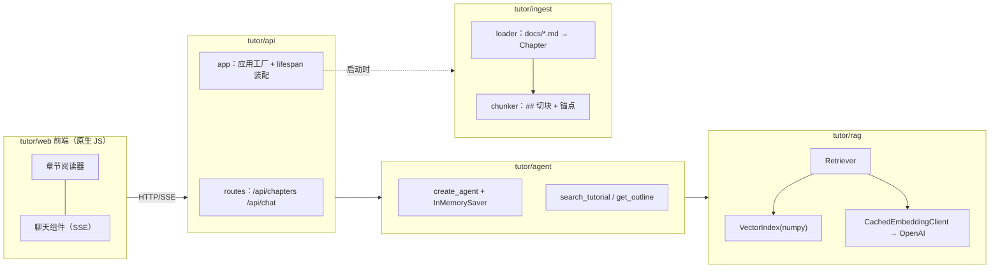

# tutor：教程教学 Agent 站点（最终实战案例）

这是本教程的"毕业设计参考实现"：把 `docs/` 里的 14 章教程变成一个可浏览的站点，并在页面右下角挂一个懂教程内容的教学助手。它把前面章节的 RAG、工具调用、`create_agent`、SSE 流式、护栏与降级全部整合进一个**分层的生产级结构**，与 `demos/` 里"单文件从上到下"的教学代码形成对照。

配套讲解见 [第 14 章：最终实战](../docs/14-teaching-agent.md)。

## 快速运行

```bash
# 在仓库根目录
uv sync
uv run uvicorn tutor.api.app:app --reload
# 打开 http://127.0.0.1:8000
```

- **不配置 `OPENAI_API_KEY`**：阅读站点完全可用，聊天输入框禁用并显示配置指引（优雅降级）。
- **配置了 Key**：首次启动会对全部章节切块并调用 Embedding 建索引（约 300 块，一次性成本），
  向量缓存在 `var/embeddings-cache.json`，之后重启秒级完成。
- **用 DeepSeek 等无 embedding 接口的服务商**：在 `.env` 中设置
  `TUTOR_EMBEDDING_PROVIDER=hash`，检索改用本地字符 n-gram 哈希向量（零成本零网络，
  质量略低于真 Embedding，但对中文字面匹配足够可用）：

```bash
OPENAI_API_KEY=sk-...           # DeepSeek 的 key
OPENAI_BASE_URL=https://api.deepseek.com
OPENAI_MODEL=deepseek-chat
TUTOR_EMBEDDING_PROVIDER=hash
```

## 架构



## 分层职责

| 包 | 职责 | 关键类型 |
|---|---|---|
| `config` | 集中配置，组件不直接读环境变量 | `Settings`（pydantic-settings） |
| `ingest` | Markdown → 章节 → 带出处的块 | `Chapter`、`Chunk`、`slugify` |
| `rag` | Embedding（带磁盘缓存）+ 余弦检索 | `EmbeddingClient` 协议、`Retriever` |
| `agent` | 提示词、工具、`create_agent` 组装 | `make_tools`、`build_agent` |
| `api` | HTTP 端点、SSE 事件流、错误翻译 | `create_app`、`/api/chat` |
| `web` | 无构建工具的静态前端 | 阅读器 + 聊天组件 |

## 与 demos 的对照

| demos 里的做法 | tutor 里的做法 | 对应章节 |
|---|---|---|
| 单文件、常量写死 | 分层包 + `Settings` 注入 | 12 |
| token 重叠检索（06_rag） | Embedding 向量检索 + 磁盘缓存 | 07 |
| 手写循环 / RuleBasedModel | `create_agent` + 真实模型 | 01/04 |
| 模拟 SSE 事件（10_service） | 从 `astream` 提取真实事件流 | 12 |
| 无引用 | 引用取自工具真实返回值，可点击跳转原文 | 07/10 |

## 设计取舍（为什么"没有更复杂"）

- **不用向量数据库**：约 300 块用 numpy 余弦足够（毫秒级），教程第 7 章讲过"规模决定选型"。
- **`InMemorySaver` 而非 SQLite**：会话记忆重启即失，是刻意暴露的"生产化差距"，作为第 14 章练习。
- **引用不靠模型口述**：`sources` 事件从 `search_tutorial` 的真实返回值提取，模型说什么不影响引用的准确性。

## 生产化差距清单（练习方向）

1. Checkpointer 换成 SQLite/Postgres，重启后会话不丢。
2. 加输入护栏 middleware（第 10 章）：注入检测、话题白名单。
3. 混合检索：BM25 + 向量 + 重排（第 7 章进阶路线）。
4. 加评测集：拿第 11 章的方法为教学助手写 20 条带标准答案的评测用例。
5. 加 Tracing：接 LangSmith 或 OpenTelemetry 观察每次检索命中质量。
